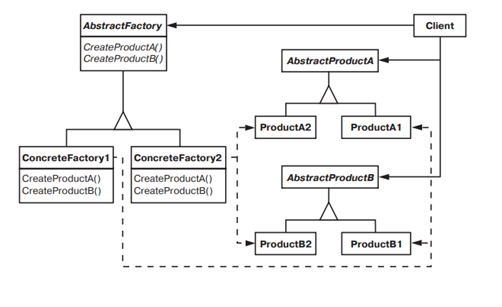

# Abstract Factory

### Название и классификация:
_Абстрактная фабрика_ – паттерн, порождающий объекты. 

### Назначение:
Предоставляет интерфейс для создания семейств взаимосвязанных или взаимозависимых объектов, не специфицируя их конкретных классов.

Другие названия:
`Kit` (инструментарий)

### Применимость:
Основные условия применения паттерна абстрактная фабрика:
*	система не должна зависеть от того, как создаются, компонуются и представляются входящие в нее объекты
*	система должна настраиваться одним из семейств объектов
*	входящие в семейство взаимосвязанные объекты спроектированы для совместной работы, и вы должны обеспечить выполнение этого ограничения
*	вы хотите предоставить библиотеку объектов, раскрывая только их интерфейсы, но не реализацию

### Структура: 

### Результаты:
Паттерн абстрактная фабрика:
*	изолирует конкретные классы (имена изготавливаемых классов известны только _конкретной фабрике_, в коде клиента они не упоминаются)
*	упрощает замену семейств продуктов (приложение может изменить конфигурацию продуктов, просто подставив новую _конкретную фабрику_; поскольку абстрактная фабрика создает все семейство продуктов, то и заменяется сразу все семейство)
*	гарантирует сочетаемость продуктов
*	не упрощает задачу поддержки нового вида продуктов (интерфейс `AbstractFactory` фиксирует набор продуктов которые можно создать. Для поддержки новых продуктов необходимо расширить интерфейс фабрики)
	
