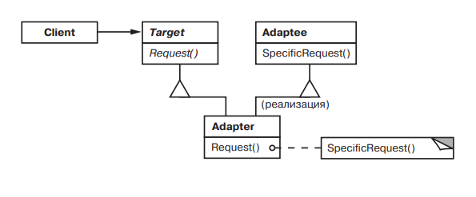

# Adapter 

### Название и классификация:
_Адаптер_ – паттерн, структурирующий классы и объекты.

### Назначение:
Преобразует интерфейс одного класса в другой интерфейс, на который рассчитаны клиенты. Адаптер обеспечивает совместную работу классов с несовместимыми интерфейсами, которая без него была бы невозможна.

### Другие названия:
`Wrapper` (обертка)

### Применимость:
Основные условия для применения паттерна _адаптер_:
*	вы хотите использовать существующий класс, но его интерфейс не соответствует вашим потребностям
*	требуется создать повторно используемый класс, который должен взаимодействовать с заранее неизвестными или не связанными с им классами, имеющими несовместимые интерфейсы
*	(_только для адаптера объектов!_) нужно использовать несколько существующих подклассов, но непрактично адаптировать их интерфейсы путем порождения новых подклассов от каждого. В этом случае адаптер объектов может приспосабливать интерфейс их общего родительского класса.

### Структура:

### Результаты:
Адаптеры объектов и классов обладают разными достоинствами и недостатками. Адаптер класса:
*	адаптирует `Adaptee` к `Targer`, перепоручая действия конкретному классу `Adaptee`. Поэтому данный паттерн не будет работать, если мы захотим одновременно адаптировать класс и его подклассы.
*	позволяет адаптеру `Adapter` заместить некоторые операции адаптируемого класса `Adaptee`, так как `Adapter` есть не что иное, как подкласс `Adaptee`
*	вводит только один новый объект. Чтобы добраться до адаптируемого класса, не нужно никакого дополнительного обращения по указателю

### Адаптер объектов:
*	позволяет одному адаптеру `Adapter` работать со многими адаптируемыми объектами `Adaptee`, то есть с самим `Adaptee` и его подклассами (если таковые имеются). Адаптер может добавить новую функциональность сразу всем адаптируемым объектам
*	затрудняет замещение операций класса `Adaptee`. Для этого потребуется породить от `Adaptee` подкласс и заставить `Adapter` ссылаться на этот подкласс, а не на сам `Adaptee`.

Ниже перечислены другие аспекты, которые следует рассмотреть, принимая решение о применении паттерна адаптер:
*	объем работы по адаптации
*	сменные адаптеры (степень повторной используемости тем выше, чем меньше предположений делается о тех классах, которые будут его применять)
*	использование двусторонних адаптеров для обеспечения прозрачности (полезны когда разные клиенты должны видеть объект по-разному) 
