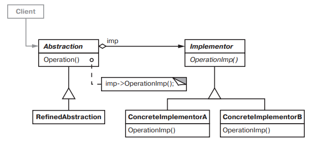

# Bridge 

### Название и классификация:
_Мост_ – паттерн, структурирующий классы объекты.

### Назначение:
Отделить абстракцию от ее реализации так, чтобы то и другое можно было изменять независимо.

### Другие названия:
`Handle/ Body` (описатель/ тело)

### Применимость:
Основные условия для применения паттерна _мост_:
*	требуется избежать постоянной привязки абстракции к реализации (т.е. реализация должна выбираться во время выполнения программы)
*	и абстракции, и реализации должны расширяться новыми подклассами (в таком случае мост позволяет комбинировать разные абстракции и реализации и изменять их независимо)
*	изменения в реализации абстракции не должны отражаться на клиентах (т.к. клиентский код не должен перекомпилироваться)
*	(_только для C++_) требуется полностью скрыть от клиентов реализацию абстракции (в `C++` представление класса видимо через его интерфейс)
*	число классов стремительно разрастается (это признак того, что иерархию следует разделить на две части. Для таких иерархий классов _Рамбо_ (_Rumbaugh_) использует термин «вложенные обобщения»)
*	реализация должна совместно использоваться несколькими объектами (этот факт должен быть скрыт от клиента)

### Структура: 

### Результаты:
Результаты применения паттерна _мост_:
*	отделение реализации от интерфейса (реализация больше не имеет постоянной привязки к интерфейсу. Объект может динамически изменять свою реализацию)
*	повышение степени расширяемости (иерархии классов `Abstraction` и `Implementor` могут расширяться независимо)
*	сокрытие деталей реализации от клиентов (клиентов можно изолировать от таких подробностей реализации, как совместное использование объектов класса `Implementor` и сопутствующего механизма подсчета ссылок)
