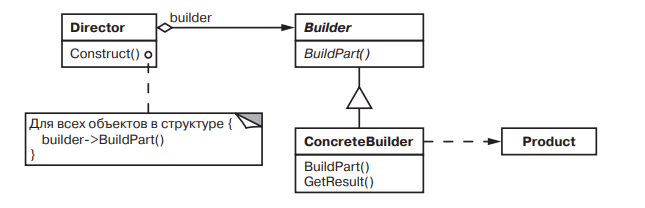

# Builder 

### Название и классификация:
_Строитель_ – паттерн, порождающий объекты.

### Назначение:
Отделяет конструирование сложного объекта от его представления, так что в результате одного и того же процесса конструирования могут получаться разные представления.

### Применимость:
Основные условия применения паттерна строитель:
*	алгоритм создания сложного объекта не должен зависеть от того, из каких частей состоит объект и как они стыкуются между собой
*	процесс конструирования должен обеспечивать различные представления конструируемого объекта

### Структура:

### Результаты:
Паттерн строитель:
*	позволяет изменять внутреннее представление продукта (достаточно определить новый вид строителя)
*	изолирует код, реализующий конструирование и представление (клиентам не надо знать о классах, определяющих внутреннюю структуру продукта, т.к. они не входят в интерфейс строителя; каждый _конкретный строитель_ содержит весь код, необходимый для создания и сборки конкретного продукта)
*	предоставляет более точный контроль над процессом конструирования (интерфейс строителя в большей степени отражает процесс конструирования нежели другие порождающие паттерны)
