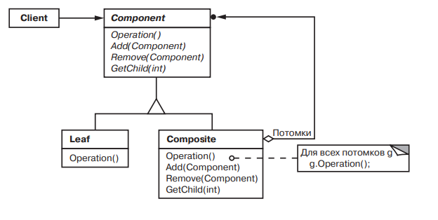

# Composite

### Название и классификация:
_Компоновщик_ – паттерн, структурирующий объекты.

### Назначение:
Компонует объекты в древовидные структуры для представления иерархий «часть-целое». Позволяет клиентам единообразно трактовать индивидуальные и составные объекты.

### Применимость:
Основные условия для применения паттерна _компоновщик_:
*	требуется представить иерархию объектов вида «часть-целое»
*	клиенты должны по единым правилам работать с составными и индивидуальными объектами.

### Структура:

### Результаты:
Паттерн _компоновщик_:
*	определяет иерархии классов, состоящие из примитивных и составных объектов (любой клиент, ожидающий получить примитивный объект, может работать и с составным)
*	упрощает архитектуру клиента (нет необходимости писать функции, ветвящиеся в зависимости от того, с объектами какого класса они работают)
*	облегчает добавление новых видов компонентов (изменять клиент при добавлении новых компонентов не нужно)
*	способствует созданию общего дизайна (однако, становится трудно установить ограничения на то, какие объекты могут входить в состав композиции; приходится проводить проверки во время выполнения
