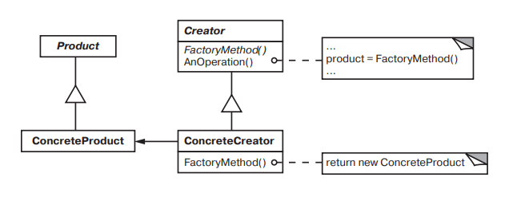

# Factory Method

### Название и классификация:
_Фабричный метод_ – паттерн, порождающий классы.

### Назначение:
Определяет интерфейс для создания объекта, но оставляет подклассам решение о том, экземпляры какого класса должны создаваться. Фабричный метод позволяет классу делегировать создание экземпляров подклассам.

### Другие названия:
`Virtual Constructor` (виртуальный конструктор)

### Применимость:
Основные условия для применения паттерна фабричный метод:
*	классу заранее неизвестно, объекты каких классов ему нужно создать
*	класс спроектирован так, чтобы объекты, которые он создает, определялись подклассами
*	класс делегирует свои обязанности одному из нескольких вспомогательных подклассов, и вам нужно локализовать информацию, о том какой класс принимает эти обязанности на себя.

### Структура:

### Результаты:
Фабричные методы избавляют проектировщика от необходимости встраивать в код зависящие от приложения классы. Код имеет дело с интерфейсом класса `Product`, поэтому он может работать с любыми определенными пользователями классами конкретных продуктов.
Потенциальный недостаток фабричного метода состоит в том, что клиентам, возможно, придется создавать подкласс класса `Creator` для создания лишь одного объекта `ConcreteProduct`. Порождение подклассов оправданно, если клиенту так или иначе приходится создавать подклассы `Creator`, в противном случае клиенту придется иметь дело с дополнительным уровнем подклассов.
А вот еще два последствия применения паттерна фабричный метод:
*	подклассам предоставляются операции-зацепки (_hooks_; создание объектов внутри класса с помощью фабричного метода, всегда оказывается более гибким решением, чем непосредственное создание)
*	соединение параллельных иерархий (параллельные иерархии возникают в случае, когда класс делегирует часть своих обязанностей другому классу, который не является производным от него)
