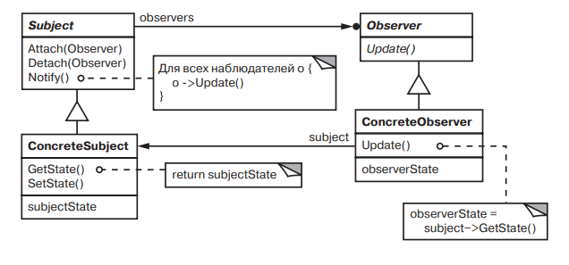

# Observer 

### Название и классификация:
_Наблюдатель_ – паттерн поведения объектов.

### Назначение:
Определяет зависимость типа «один ко многим» между объектами таким образом, что при изменении состояния одного объекта все зависящие от него оповещаются об этом и автоматически обновляются.

### Другие названия:
`Dependents` (подчиненные) , `Publish-Subscribe` (издатель - подписчик)

### Применимость:
Основные условия для применения паттерна _наблюдатель_:
*	у абстракции есть два аспекта, один из которых зависит от другого. Инкапсуляции этих аспектов в разные объекты позволяют изменять и повторно использовать их независимо
*	при модификации одного объекта требуется изменить другие, и вы не знаете, сколько именно объектов нужно изменить
*	один объект должен оповещать других, не делая предположений об уведомляемых объектах. Другими словами, объекты не должны быть тесно связаны между собой.

### Структура:

### Результаты:
Паттерны наблюдатель позволяет изменять субъекты и наблюдатели независимо друг от друга. Субъекты разрешается повторно использовать без участия наблюдателей, и наоборот. Это дает возможность добавлять новых наблюдателей без модификации субъекта или других наблюдателей.
Основные достоинства и недостатки паттерна _наблюдатель_:
*	абстрактная связанность субъекта и наблюдателя (субъект имеет информацию лишь о том, что у него есть ряд наблюдателей, каждый из которых подчиняется простому интерфейсу абстрактного класса `Observer`. _Субъекту_ неизвестны конкретные классы наблюдателей.)
*	поддержка широковещательных коммуникаций (для уведомления, посылаемого субъектом, не нужно задавать определенного получателя, уведомление автоматически поступает всем подписавшимся на него объектам; от субъекта требуется всего лишь уведомить своих наблюдателей)
*	неожиданные обновления (поскольку наблюдатели не располагают информацией друг о друге, им неизвестно и о том, во что обходится изменение субъекта; операция над субъектом может вызвать целый ряд обновлений наблюдателей и зависящих от них объектов)
