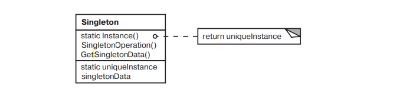

# Singleton

### Название и классификация:
_Одиночка_ – паттерн, порождающий объекты.

### Назначение:
Гарантирует, что у класса существует только один экземпляр, и предоставляет к нему глобальную точку доступа.

### Применимость:
Основные условия для применения паттерна `одиночка`:
*	должен существовать ровно один экземпляр некоторого класса, к которому может обратиться любой клиент через известную точку доступа
*	единственный экземпляр должен расширяться путем порождения подклассов, а клиенты должны иметь возможность работать с расширенным экземпляром без модификации своего кода

### Структура: 

### Результаты:
Паттерн `одиночка` обладает рядом достоинств:
*	контролируемый доступ к единственному экземпляру (полный контроль того, как и когда клиенты получают доступ к единственному экземпляру)
*	сокращение пространства имен (позволяет избежать засорения пространства имен глобальными переменными, в которых хранятся уникальные экземпляры)
*	возможность уточнения операций и представления (приложение можно настроить экземпляром нужного класса во время выполнения)
*	возможность использования переменного числа экземпляров (позволяет легко изменить решение и разрешить появление более одного экземпляра класса `Singleton`; тот же подход может использоваться для управления числом экземпляров, используемых в приложении, изменить нужно будет лишь операцию, дающую доступ к экземпляру класса `Singleton`)
*	большая гибкость, чем у операций класса

Клиенты запрашивают единственный объект класса через статическую функцию-член `getInstance()`, которая при первом запросе динамически выделяет память под этот объект и затем возвращает указатель на этот участок памяти. Впоследствии клиенты должны сами позаботиться об освобождении памяти при помощи оператора `delete`.
Последняя особенность является серьезным недостатком классической реализации шаблона `Singleton`. Так как класс сам контролирует создание единственного объекта, было бы логичным возложить на него ответственность и за разрушение объекта. Этот недостаток отсутствует в реализации `Singleton`, впервые предложенной _Скоттом Мэйерсом_.

### Singleton Мэйерса 

Ключевой особенностью этой реализации является наличие класса `SingletonDestroyer`, предназначенного для автоматического разрушения объекта `Singleton`. Класс `Singleton` имеет статический член `SingletonDestroyer`, который инициализируется при первом вызове `Singleton::getInstance()` создаваемым объектом `Singleton`. При завершении программы этот объект будет автоматически разрушен деструктором `SingletonDestroyer` (для этого `SingletonDestroyer` объявлен другом класса `Singleton`).
Для предотвращения случайного удаления пользователями объекта класса `Singleton`, деструктор теперь уже не является общедоступным как ранее. Он объявлен защищенным.

