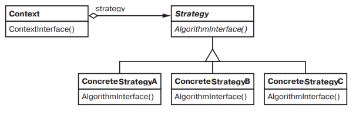

# Strategy

### Название и классификация:
_Стратегия_ – паттерн поведения объектов.

### Назначение:
Определяет семейство алгоритмов, инкапсулирует каждый из них и делает их взаимозаменяемыми. _Стратегия_ позволяет изменять алгоритмы независимо от клиентов, которые ими пользуются.

### Другие названия:
`Policy` (политика)

### Применимость:
Основные условия для применения паттерна стратегия:
*	наличие множества родственных классов, отличающихся только поведением (стратегия позволяет настроить класс одним из многих возможных вариантов поведения)
*	наличие нескольких разновидностей алгоритма (например, можно определить два варианта алгоритма, один из которых требует больше времени, а другой – больше памяти; _стратегии_ разрешается применять, когда варианты алгоритмов реализованы в виде иерархии классов)
*	в алгоритме содержатся данные, которые клиент не должен «знать» (используйте паттерн _стратегия_, чтобы не раскрывать сложные специфичные для алгоритма структуры данных)
*	в классе определено много вариантов поведения, представленных разветвленными условными операторами (в этом случае проще и лучше перенести код из ветвей в отдельные классы стратегий)

### Структура:

### Результаты:
Основные достоинства и недостатки паттерна _стратегия_:
*	семейства родственных алгоритмов (позволяет повторное использование в разных контекстах; наследование позволяет вычленить общую для всех алгоритмов функциональность)
*	альтернатива порождению подклассов (наследование поддерживает многообразие алгоритмов или поведений; можно напрямую породить от `Context` подклассы с различными поведениями, но при этом поведение жестко «зашивается» в класс `Context`)
*	стратегии позволяют избавиться от условных конструкций (с паттерном _стратегия_ удается отказаться от условных операторов при выборе нужного поведения)
*	выбор реализации (_стратегии_ могут предлагать клиенту различные реализации одного и того же поведения, клиент в праве выбирать подходящую _стратегию_ от своих требований)
*	клиенты должны знать о различных стратегиях (потенциальный недостаток в том, что клиент должен понимать в чем отличия разных _стратегий_, ему придется раскрыть некоторые особенности реализации)
*	затраты на передачу информации между _стратегией_ и контекстом
*	увеличение числа объектов (применение _стратегий_ увеличивает число объектов в приложении) 
